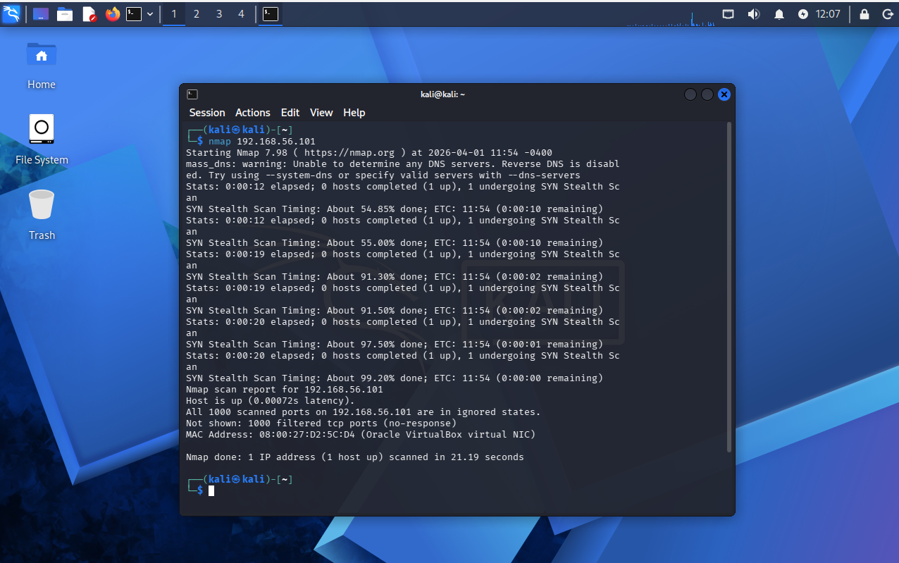

# Network Reconnaissance Lab

Hands-on network reconnaissance against a hardened Windows host using Kali Linux and Nmap. Demonstrates how Windows Defender Firewall affects external visibility into a target system.

## MITRE ATT&CK Mapping
- **T1046** — Network Service Discovery
- **T1018** — Remote System Discovery

## Lab Environment
| Component | Details |
|-----------|---------|
| Hypervisor | VirtualBox |
| Attacker | Kali Linux (192.168.56.x) |
| Target | Windows 11 (192.168.56.101) |
| Network | Host-only adapter |

## Methodology

### 1. Reconnaissance
Ran a default TCP scan against the Windows target:
```bash
nmap 192.168.56.101
```

### 2. Results
Nmap scan report for 192.168.56.101
Host is up (0.00072s latency).
All 1000 scanned ports on 192.168.56.101 are in ignored states.
Not shown: 1000 filtered tcp ports (no-response)



## Analysis
All 1000 ports returned `filtered/no-response`, meaning Windows Defender Firewall silently dropped the SYN packets without replying. From an attacker perspective, the host appears effectively invisible at the TCP layer — no service fingerprinting possible without additional techniques.

## Defensive Takeaways
- Default Windows Firewall posture significantly reduces external attack surface
- Filtered ≠ closed — a filtered response indicates active firewall intervention, which is itself a signal
- Attackers would need to pivot to alternative recon (UDP, fragmented packets, application-layer probes) or move laterally from a compromised host

## Next Steps
- Repeat scan with `-sU` (UDP), `-f` (fragmentation), and `--source-port 53` to test firewall rule gaps
- Add Sysmon + Splunk on the target to capture the recon attempt from the defender's perspective (see [windows-endpoint-detection-lab](https://github.com/pkmelee/windows-endpoint-detection-lab))

## Skills Demonstrated
Virtual lab architecture · Network reconnaissance · Nmap scanning · TCP/IP analysis · Firewall behavior interpretation · MITRE ATT&CK framework
